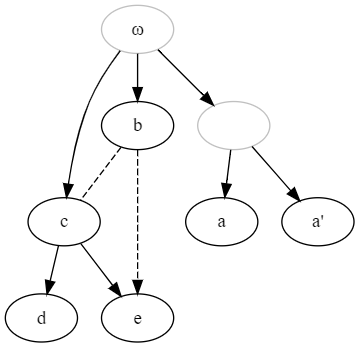

# Open Stemmata Database

This repository contains an open source collection of historical text genealogies, in forms of tree-like graphs (stemma) for a variety of languages.

## Contributing

### Sending your contribution

You can contribute by sending us images and/or metadata and DOT files,

- by making a pull request on the main branch (preferred);
- by sending it to us via email.

If you wish to contribute, have a look at the [examples](./tree/master/examples) folder:

It contains several cases:

- a minimal record:
- a simple case, but with very complete metadata: [./tree/dev/examples/Segre_1971_Roland]
- an intermediary case: [./tree/dev/examples/Paris_1872_Alexis]
- a full case with …

You can also read our more detailed [Guidelines](https://openstemmata.github.io/guidelines.html) !

### Organisation of a record

Actual data is stored in the [data](./tree/master/data) folder, and are sorted by linguistic code (e.g., `fro` for Old French traditions; `gmh` for Middle High German).

Each record is contained in a dedicated folder, and can contain up to three elements:

- `stemma.png`: scan from the source edition;
- `metadata.txt`: metadata file about the stemma
- `stemma.gv`: GraphViz DOT format file for the stemma.

### Generating metadata and DOT files

The following resources can help you create the necessary files:

- [Our form metadata creator](https://openstemmata.github.io/document-your-stemma.html): just fill up the form and get the txt content. 
- [**Edotor**](https://edotor.net/?engine=dot?engine=dot#%23%20Place%20the%20cursor%20inside%20%22graph%22%20to%20get%20some%20refactoring%20options%0A%0Adigraph%20%7B%0A%0A%20%20%20%20%23%20To%20refactor%20nodes%2C%20place%20the%20cursor%20left%20to%20a%20node%20name%0A%20%20%20%20omega%20-%3E%20b%3B%0A%20%20%20%20omega%20-%3E%20c%3B%0A%20%20%20%20c%20-%3E%20d%3B%0A%20%20%20%20c%20-%3E%20e%3B%0A%20%20%20%20omega%20-%3E%201%3B%20%0A%20%20%20%201%20-%3E%20a%20%23%20use%20numbers%20for%20unlabelled%20nodes%20in%20the%20source%20stemma%0A%20%20%20%201%20-%3E%20aprime%0A%0A%20%20%20%20%23%20Hover%20over%20color%20names%20to%20get%20a%20color%20picker%0A%20%20%20%20b%20-%3E%20e%20%5Bstyle%3D%22dashed%22%5D%0A%20%20%20%20b%20-%3E%20c%20%5Bdir%3Dnone%2C%20style%3D%22dashed%22%5D%3B%20%23%20for%20the%20exception%20where%20an%20undirected%20link%20is%20existant.%0A%0A%20%20%20%20%23%20Grey%20color%20is%20used%20for%20hypothetical%20nodes%3B%20labels%20can%20be%20redefined%20if%20needed%0A%20%20%20%20omega%20%5Bcolor%3D%22grey%22%5D%3B%0A%20%20%20%201%20%5Bcolor%3D%22grey%22%2C%20label%3D%22%22%5D%3B%20%0A%20%20%20%20aprime%5Blabel%3D%22a'%22%5D%0A%0A%7D%0A): a free online DOT editor with graphical view.

DOT format is quite easy to master, and uses the following patterns:

- `a -> b` link from a to b
- `a -> b [style="dashed"]` dashed link from a to b (contamination)
- `alpha -> b` link from alpha to b
- `alpha[color="grey"]` color alpha in grey (for hypothetical nodes, i.e., not extant manuscripts);
- `1 -> a` link from 1 (unnamed hypothetical node in the source) to a.

**<span style="color:red">If you're hesitant, head over to the online [*editor*](https://edotor.net/?engine=dot?engine=dot#%23%20Place%20the%20cursor%20inside%20%22graph%22%20to%20get%20some%20refactoring%20options%0A%0Adigraph%20%7B%0A%0A%20%20%20%20%23%20To%20refactor%20nodes%2C%20place%20the%20cursor%20left%20to%20a%20node%20name%0A%20%20%20%20omega%20-%3E%20b%3B%0A%20%20%20%20omega%20-%3E%20c%3B%0A%20%20%20%20c%20-%3E%20d%3B%0A%20%20%20%20c%20-%3E%20e%3B%0A%20%20%20%20omega%20-%3E%201%3B%20%0A%20%20%20%201%20-%3E%20a%20%23%20use%20numbers%20for%20unlabelled%20nodes%20in%20the%20source%20stemma%0A%20%20%20%201%20-%3E%20aprime%0A%0A%20%20%20%20%23%20Hover%20over%20color%20names%20to%20get%20a%20color%20picker%0A%20%20%20%20b%20-%3E%20e%20%5Bstyle%3D%22dashed%22%5D%0A%20%20%20%20b%20-%3E%20c%20%5Bdir%3Dnone%2C%20style%3D%22dashed%22%5D%3B%20%23%20for%20the%20exception%20where%20an%20undirected%20link%20is%20existant.%0A%0A%20%20%20%20%23%20Grey%20color%20is%20used%20for%20hypothetical%20nodes%3B%20labels%20can%20be%20redefined%20if%20needed%0A%20%20%20%20omega%20%5Bcolor%3D%22grey%22%5D%3B%0A%20%20%20%201%20%5Bcolor%3D%22grey%22%2C%20label%3D%22%22%5D%3B%20%0A%20%20%20%20aprime%5Blabel%3D%22a'%22%5D%0A%0A%7D%0A) for creating the file !</span>**


We use the following conventions for the DOT files: 

- directed links (`->`, with exceptional undirected links if existing in the source
indicated with `[dir=none]`)
- dashed lines for contamination (with `[style="dashed"]`)
- grey color for hypothetical link (with `[color="grey"]`
- numbers for unnamed nodes in the source.

Here is an (already complex) example file with output:

```mscgen
digraph {

    # To refactor nodes, place the cursor left to a node name
    omega -> b;
    omega -> c;
    c -> d;
    c -> e;
    omega -> 1; 
    1 -> a # use numbers for unlabelled nodes in the source stemma
    1 -> aprime
    
    b -> e [style="dashed"] # use "dashed" to indicate contamination
    b -> c [dir=none, style="dashed"]; # use dir=none for the exception where an undirected link is existant.
    
    # Hover over color names to get a color picker
    # Grey color is used for hypothetical nodes; labels can be redefined if needed
    1 [color="grey", label=""]; 
    
    aprime[label="a'"] # We can use the label attribute to indicate the visual representation of a nodes' name
    
    # It is common to use Greek letters for hypotetical nodes. 
    # We recommend naming them with a transliteration of their name in the Latin script ("alpha", "beta", etc.)
    # Optionally, we can add the Greek letters as the label fot those nodes.
    # Here is a list of those letters if you don't know how to type them on your keyboard: 
    # Α α, Β β, Γ γ, Δ δ, Ε ε, Ζ ζ, Η η, Θ θ, Ι ι, Κ κ, Λ λ, Μ μ, Ν ν, Ξ ξ, Ο ο, Π π, Ρ ρ, Σ σ, Τ τ, Υ υ, Φ φ, Χ χ, Ψ ψ, Ω ω
    omega [color="grey", label="ω"];
    
}

```

Result:




## License

Shield: [![CC BY-SA 4.0][cc-by-sa-shield]][cc-by-sa]

This work is licensed under a
[Creative Commons Attribution-ShareAlike 4.0 International License][cc-by-sa].

[![CC BY-SA 4.0][cc-by-sa-image]][cc-by-sa]

[cc-by-sa]: http://creativecommons.org/licenses/by-sa/4.0/
[cc-by-sa-image]: https://licensebuttons.net/l/by-sa/4.0/88x31.png
[cc-by-sa-shield]: https://img.shields.io/badge/License-CC%20BY--SA%204.0-lightgrey.svg
